# Mermaidjs examples

## Flowchart simple down

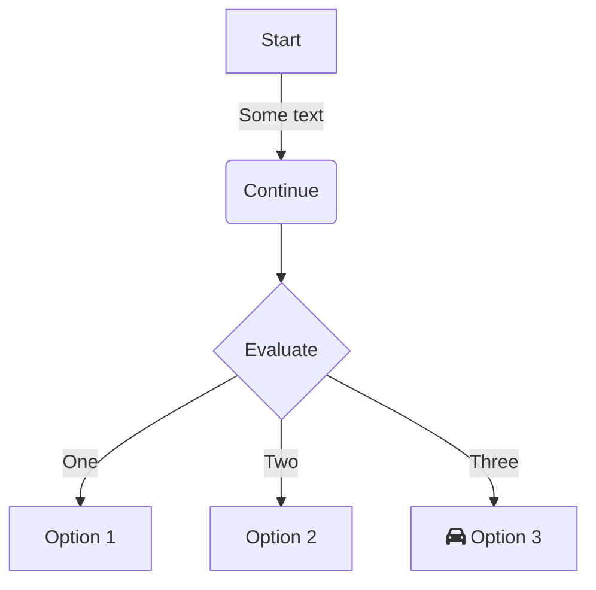
```mermaid
flowchart TB
    A[Start] --Some text--> B(Continue)
    B --> C{Evaluate}
    C -- One --> D[Option 1]
    C -- Two --> E[Option 2]
    C -- Three --> F[fa:fa-car Option 3]
```


## User journey

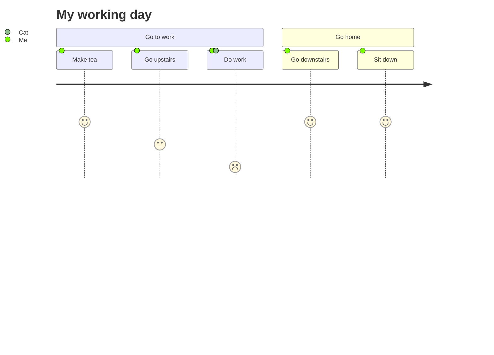
```mermaid
journey
    title My working day
    section Go to work
        Make tea: 5: Me
        Go upstairs: 3: Me
        Do work: 1: Me, Cat
    section Go home
        Go downstairs: 5: Me
        Sit down: 5: Me
```

## Timeline

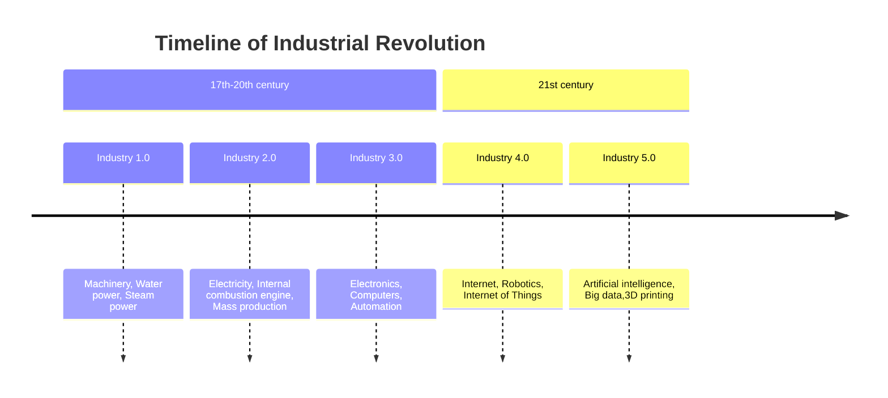
```mermaid
timeline
    title Timeline of Industrial Revolution
    section 17th-20th century
        Industry 1.0 : Machinery, Water power, Steam <br>power
        Industry 2.0 : Electricity, Internal combustion engine, Mass production
        Industry 3.0 : Electronics, Computers, Automation
    section 21st century
        Industry 4.0 : Internet, Robotics, Internet of Things
        Industry 5.0 : Artificial intelligence, Big data,3D printing
```

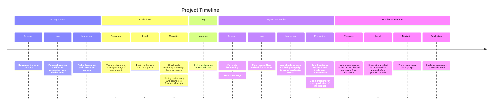
```mermaid
timeline
    title Project Timeline
    section January - March
        Research : Begin working on a prototype
        Legal : Research patents and if other companies have similar ideas
        Marketing : Probe the market and look for an opening
    section April - June
        Research : Test prototype and investigate ways of improving it
        Legal : Begin working on filing for a patent
        Marketing : Small scale marketing campaign, look for testers : Identify tester group and connect to Product Manager
    section July
        Vacation : Only maintenance work conducted
    section August - September
        Research : Move into beta-testing : Record learnings
        Legal : Finish patent filing and wait for approval
        Marketing : Launch a large scale marketing campaign to gauge purchasing interest
        Production: Take beta tester feedback and implement improvements : Begin preparing for mass production of the product
    section October - December
        Research : Implement changes to the product based on results from beta-testing
        Legal : Ensure the product is protected by patent before product launch
        Marketing : Try to reach new client groups
        Production: Scale up production to meet demand
```

## Gantt Chart 

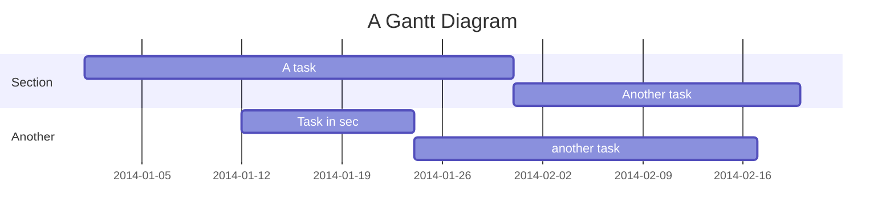
```mermaid
gantt
    title A Gantt Diagram
    dateFormat  YYYY-MM-DD
    section Section
    A task           :a1, 2014-01-01, 30d
    Another task     :after a1  , 20d
 

    section Another
    Task in sec      :2014-01-12  , 12d
    another task      : 24d
```


```mermaid
gantt
    dateFormat HH:mm
    axisFormat %H:%M
    Initial milestone : milestone, m1, 17:49, 2m
    Task A : 10m
    Task B : 5m
    Final milestone : milestone, m2, 18:08, 4m
```

## Quadrant Chart

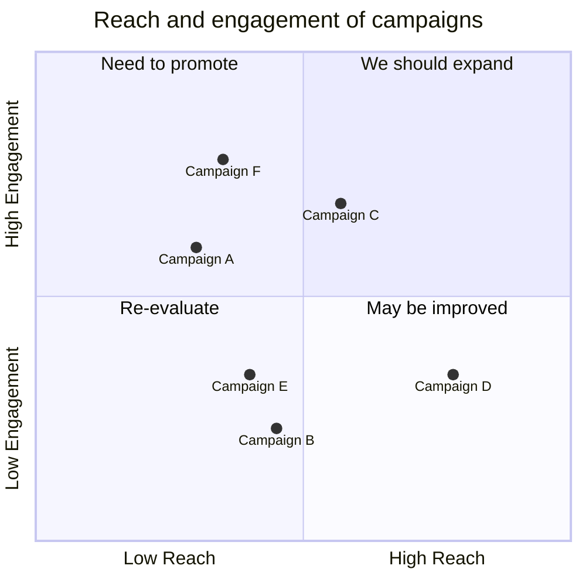
```mermaid
quadrantChart
    title Reach and engagement of campaigns
    x-axis Low Reach --> High Reach
    y-axis Low Engagement --> High Engagement
    quadrant-1 We should expand
    quadrant-2 Need to promote
    quadrant-3 Re-evaluate
    quadrant-4 May be improved
    Campaign A: [0.3, 0.6]
    Campaign B: [0.45, 0.23]
    Campaign C: [0.57, 0.69]
    Campaign D: [0.78, 0.34]
    Campaign E: [0.40, 0.34]
    Campaign F: [0.35, 0.78]
```

## Sankey

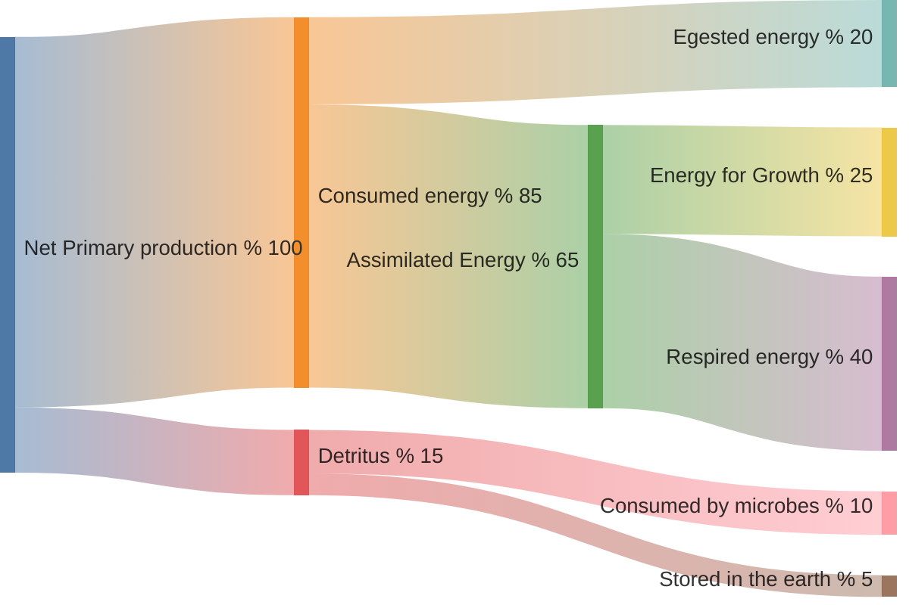
```mermaid
sankey-beta
Net Primary production %,Consumed energy %,85
Net Primary production %,Detritus %,15
Consumed energy %,Egested energy %,20%
Consumed energy %,Assimilated Energy %,65
Assimilated Energy %, Energy for Growth %, 25
Assimilated Energy %, Respired energy %, 40
Detritus %, Consumed by microbes %, 10
Detritus %, Stored in the earth %, 5

```

## State Diagram

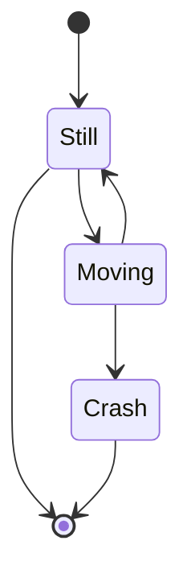
```mermaid
stateDiagram
    [*] --> Still
    Still --> [*]
    Still --> Moving
    Moving --> Still
    Moving --> Crash
    Crash --> [*]
```

## Sequence Basic

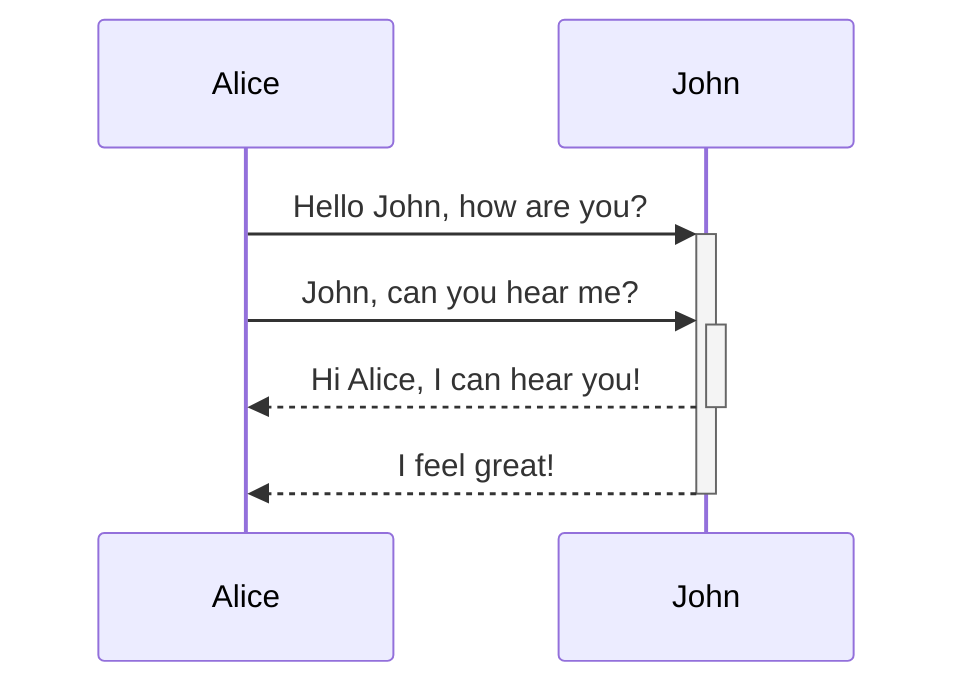
```mermaid
sequenceDiagram
    Alice->>+John: Hello John, how are you?
    Alice->>+John: John, can you hear me?
    John-->>-Alice: Hi Alice, I can hear you!
    John-->>-Alice: I feel great!
```

## Sequence with Autonumbering

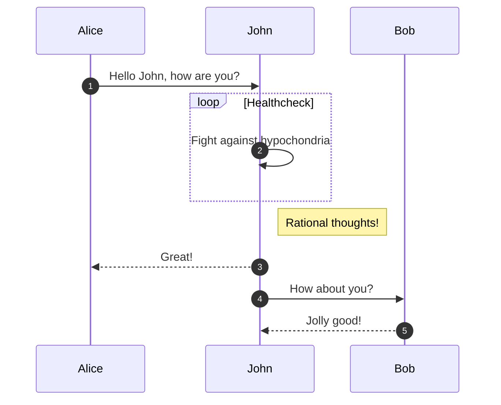
```mermaid
sequenceDiagram
    autonumber
    Alice->>John: Hello John, how are you?
    loop Healthcheck
        John->>John: Fight against hypochondria
    end
    Note right of John: Rational thoughts!
    John-->>Alice: Great!
    John->>Bob: How about you?
    Bob-->>John: Jolly good!
```

## Sequence with color rectangles

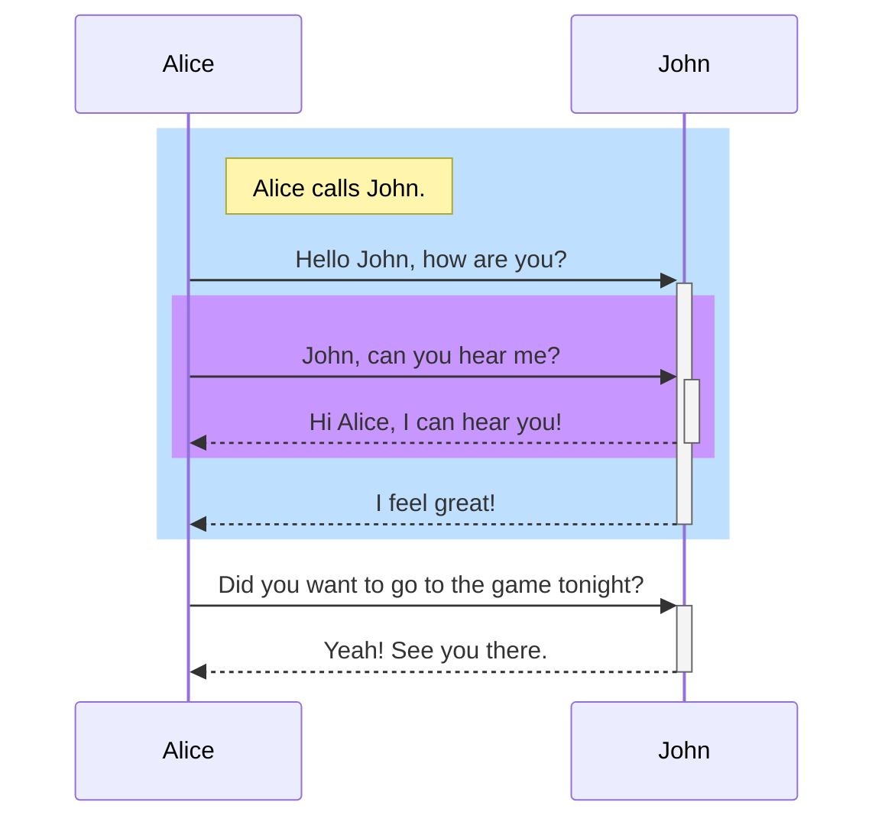
```mermaid
sequenceDiagram
    participant Alice
    participant John

    rect rgb(191, 223, 255)
    note right of Alice: Alice calls John.
    Alice->>+John: Hello John, how are you?
    rect rgb(200, 150, 255)
    Alice->>+John: John, can you hear me?
    John-->>-Alice: Hi Alice, I can hear you!
    end
    John-->>-Alice: I feel great!
    end
    Alice ->>+ John: Did you want to go to the game tonight?
    John -->>- Alice: Yeah! See you there.
```

## Class Diagram

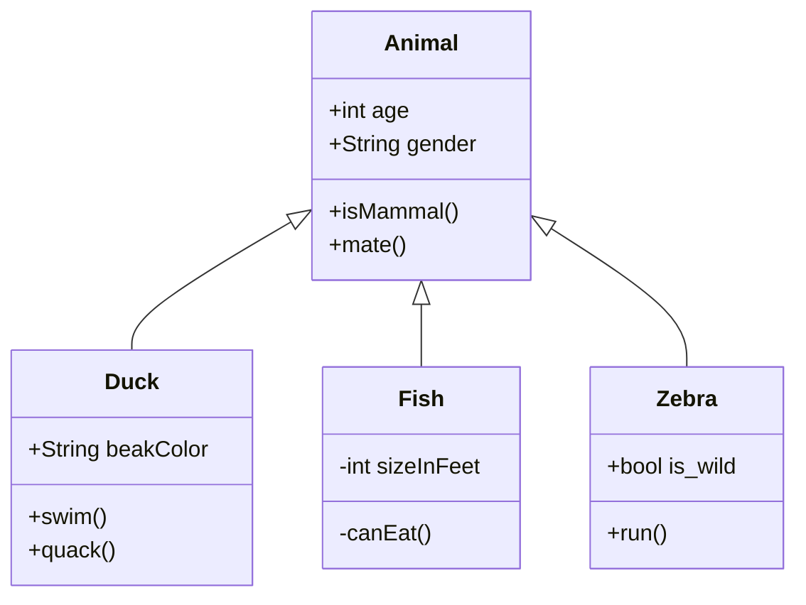
```mermaid
classDiagram
    Animal <|-- Duck
    Animal <|-- Fish
    Animal <|-- Zebra
    Animal : +int age
    Animal : +String gender
    Animal: +isMammal()
    Animal: +mate()
    class Duck{
      +String beakColor
      +swim()
      +quack()
    }
    class Fish{
      -int sizeInFeet
      -canEat()
    }
    class Zebra{
      +bool is_wild
      +run()
    }
```

## Class Schema Issue Tracking

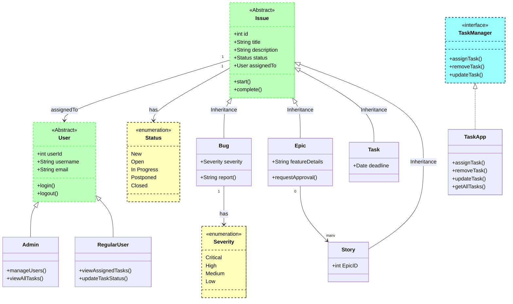
```mermaid
classDiagram
    class Issue {
        <<Abstract>>
        +int id
        +String title
        +String description
        +Status status
        +User assignedTo
        +start()
        +complete()
    }

    class Bug {
        +Severity severity
        +String report()
    }

    class Epic {
        +String featureDetails
        +requestApproval()
    }

    class Story {
        +int EpicID
    }

    class Task {
        +Date deadline
    }

    class User {
        <<Abstract>>
        +int userId
        +String username
        +String email
        +login()
        +logout()
    }
    
    class Admin {
        +manageUsers()
        +viewAllTasks()
    }

    class RegularUser {
        +viewAssignedTasks()
        +updateTaskStatus()
    }

    class TaskManager {
        <<interface>>
        +assignTask()
        +removeTask()
        +updateTask()
    }
    TaskManager <|.. TaskApp

    class TaskApp {
        +assignTask()
        +removeTask()
        +updateTask()
        +getAllTasks()
    }

    class Status {
        <<enumeration>>
        New
        Open
        In Progress
        Postponed
        Closed
    }

    class Severity {
        <<enumeration>>
        Critical
        High
        Medium
        Low
    }

    Issue "1" -->  User : assignedTo
    Issue "1" --> Status : has
    Bug "1" --> Severity : has
    Issue <|-- Bug : Inheritance
    Issue <|-- Epic : Inheritance
    Issue <|-- Task : Inheritance
    Issue <|-- Story : Inheritance
    Epic "0" --> "many" Story
    User <|-- Admin
    User <|-- RegularUser
    
    style Issue fill:#bfb,stroke:#6f6,stroke-width:2px,color:#000,stroke-dasharray: 5 5
    style User fill:#bfb,stroke:#6f6,stroke-width:2px,color:#000,stroke-dasharray: 5 5
    style TaskManager fill:#9ff,stroke:#369,stroke-width:2px,color:#000,stroke-dasharray: 5 5
    style Status fill:#ffb,stroke:#663,stroke-width:2px,color:#000,stroke-dasharray: 5 5
    style Severity fill:#ffb,stroke:#663,stroke-width:2px,color:#000,stroke-dasharray: 5 5
```

## ER Diagram

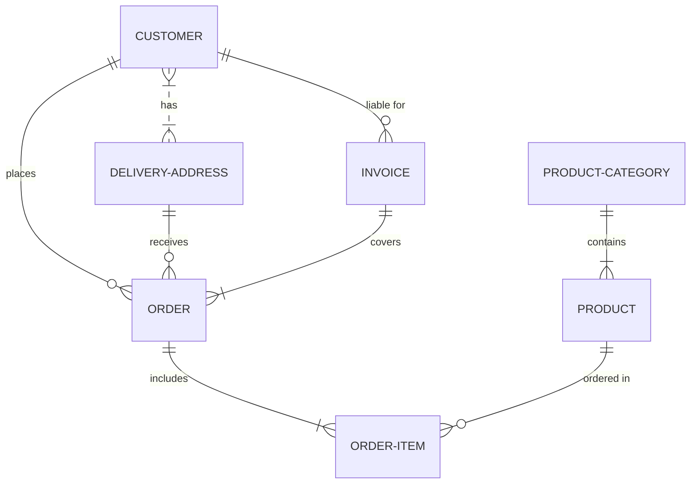
```mermaid
erDiagram
    CUSTOMER }|..|{ DELIVERY-ADDRESS : has
    CUSTOMER ||--o{ ORDER : places
    CUSTOMER ||--o{ INVOICE : "liable for"
    DELIVERY-ADDRESS ||--o{ ORDER : receives
    INVOICE ||--|{ ORDER : covers
    ORDER ||--|{ ORDER-ITEM : includes
    PRODUCT-CATEGORY ||--|{ PRODUCT : contains
    PRODUCT ||--o{ ORDER-ITEM : "ordered in"
```

## Flowchart

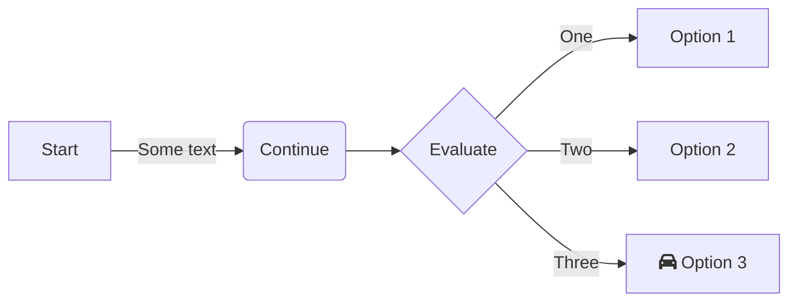
```mermaid
flowchart LR
  A[Start] --Some text--> B(Continue)
  B --> C{Evaluate}
  C -- One --> D[Option 1]
  C -- Two --> E[Option 2]
  C -- Three --> F[fa:fa-car Option 3]
```

## Flowchart

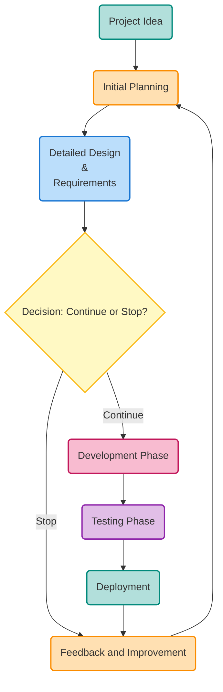
```mermaid
flowchart TD
%% Nodes
A("Project Idea"):::green
B("Initial Planning"):::orange
C("Detailed Design <br> & <br> Requirements"):::blue
D{"Decision: Continue or Stop?"}:::yellow
E("Development Phase"):::pink
F("Testing Phase"):::purple
G("Deployment"):::green
H("Feedback and Improvement"):::orange

%% Edges
A --> B --> C --> D
D -- Continue --> E --> F --> G
D -- Stop --> H
G --> H
H --> B

%% Styling
classDef green fill:#B2DFDB,stroke:#00897B,stroke-width:2px;
classDef orange fill:#FFE0B2,stroke:#FB8C00,stroke-width:2px;
classDef blue fill:#BBDEFB,stroke:#1976D2,stroke-width:2px;
classDef yellow fill:#FFF9C4,stroke:#FBC02D,stroke-width:2px;
classDef pink fill:#F8BBD0,stroke:#C2185B,stroke-width:2px;
classDef purple fill:#E1BEE7,stroke:#8E24AA,stroke-width:2px;
```

## FLowchart multiple decision points and colors

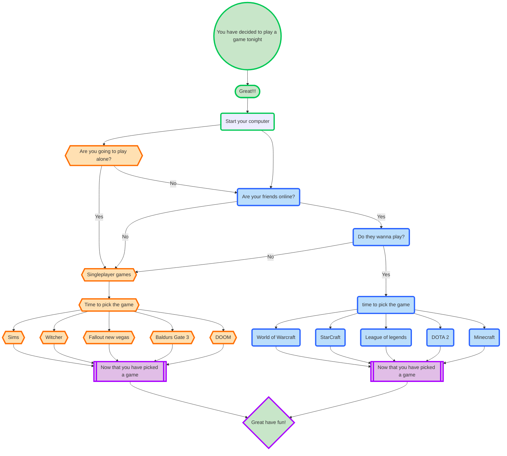
```mermaid
flowchart TD
  A(("You have decided to play a game tonight")) --> n8(["Great!!!"])
  ny{{"Are you going to play alone?"}} -- Yes --> nq{{"Singleplayer games"}}
  n8 --> np("Start your computer")
  np --> ny
  n7("Are your friends online?") -- Yes --> nw("Do they wanna play?")
  nq --> nc{{"Time to pick the game"}}
  n7 -- No --> nq
  nw -- No --> nq
  nw -- Yes --> n2("time to pick the game")
  n2 --> n1("World of Warcraft") & n9("StarCraft") & nj("League of legends") & ns("DOTA 2") & nu("Minecraft")
  nc --> ni{{"DOOM"}} & nk{{"Baldurs Gate 3"}} & nb{{"Fallout new vegas"}} & n0{{"Witcher"}} & nl{{"Sims"}}
  nl --> nf[["Now that you have picked a game"]]
  n0 --> nf
  nb --> nf
  nk --> nf
  ni --> nf
  n1 --> no[["Now that you have picked a game"]]
  n9 --> no
  nj --> no
  ns --> no
  nu --> no
  nf --> nd{"Great have fun!"}
  no --> nd
  ny -- No --> n7
  np --> n7
  style A fill:#C8E6C9,stroke-width:4px,stroke-dasharray: 0,stroke:#00C853
  style n8 stroke-width:4px,stroke-dasharray: 0,fill:#C8E6C9,stroke:#00C853
  style ny stroke-width:4px,stroke-dasharray: 0,stroke:#FF6D00,fill:#FFE0B2
  style nq stroke-width:4px,stroke-dasharray: 0,stroke:#FF6D00,fill:#FFE0B2
  style np stroke:#00C853,stroke-width:4px,stroke-dasharray: 0
  style n7 stroke-width:4px,stroke-dasharray: 0,fill:#BBDEFB,stroke:#2962FF
  style nw stroke-width:4px,stroke-dasharray: 0,stroke:#2962FF,fill:#BBDEFB
  style nc stroke-width:4px,stroke-dasharray: 0,stroke:#FF6D00,fill:#FFE0B2
  style n2 stroke-width:4px,stroke-dasharray: 0,fill:#BBDEFB,stroke:#2962FF
  style n1 stroke-width:4px,stroke-dasharray: 0,fill:#BBDEFB,stroke:#2962FF
  style n9 stroke-width:4px,stroke-dasharray: 0,fill:#BBDEFB,stroke:#2962FF
  style nj stroke-width:4px,stroke-dasharray: 0,fill:#BBDEFB,stroke:#2962FF
  style ns stroke-width:4px,stroke-dasharray: 0,fill:#BBDEFB,stroke:#2962FF
  style nu stroke-width:4px,stroke-dasharray: 0,fill:#BBDEFB,stroke:#2962FF
  style ni stroke-width:4px,stroke-dasharray: 0,fill:#FFE0B2,stroke:#FF6D00
  style nk stroke-width:4px,stroke-dasharray: 0,stroke:#FF6D00,fill:#FFE0B2
  style nb stroke-width:4px,stroke-dasharray: 0,stroke:#FF6D00,fill:#FFE0B2
  style n0 stroke-width:4px,stroke-dasharray: 0,stroke:#FF6D00,fill:#FFE0B2
  style nl stroke-width:4px,stroke-dasharray: 0,stroke:#FF6D00,fill:#FFE0B2
  style nf stroke:#AA00FF,stroke-width:4px,stroke-dasharray: 0,fill:#E1BEE7
  style no stroke-width:4px,stroke-dasharray: 0,fill:#E1BEE7,stroke:#AA00FF
  style nd stroke-width:4px,stroke-dasharray: 0,stroke:#AA00FF,fill:#C8E6C9
```

## Flowchart choose test type

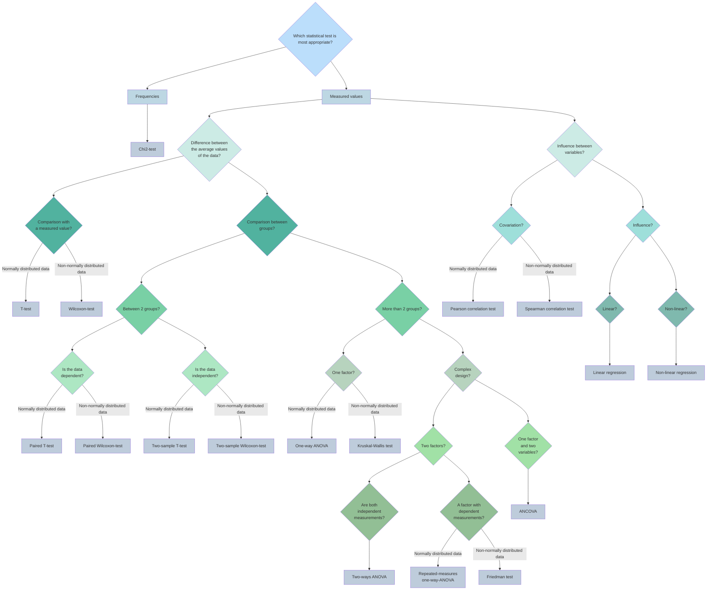
```mermaid
flowchart TD
  F{"Which statistical test is most appropriate?"} --> na["Frequencies"] & nh["Measured values"]
  na --> n1["Chi2-test"]
  nh --> nk{"Difference between 
  the average values 
  of the data?"} & n5{"Influence between 
  variables?"}
  nk --> nx{"Comparison with 
  a measured value?"} & nd{"Comparison between 
  groups?"}
  nx -- Normally distributed data --> nc["T-test"]
  nx -- Non-normally distributed data --> nw["Wilcoxon-test"]
  nd --> ne{"Between 2 groups?"} & nu{"More than 2 groups?"}
  ne --> n6{"Is the data 
  dependent?"} & nq{"Is the data 
  independent?"}
  n6 -- Normally distributed data --> np["Paired T-test"]
  n6 -- Non-normally distributed data --> ng["Paired Wilcoxon-test"]
  nq -- Normally distributed data --> n8["Two-sample T-test"]
  nq -- Non-normally distributed data --> n0["Two-sample Wilcoxon-test"]
  n5 --> n9{"Covariation?"} & n3{"Influence?"}
  n9 -- Normally distributed data --> n4["Pearson correlation test"]
  n9 -- Non-normally distributed data --> ni["Spearman correlation test"]
  n3 --> nm{"Linear?"} & n7{"Non-linear?"}
  nm --> nf["Linear regression"]
  n7 --> ns["Non-linear regression"]
  nu --> nn{"One factor?"} & ny{"Complex 
  design?"}
  nn -- Normally distributed data --> nj["One-way ANOVA"]
  nn -- Non-normally distributed data --> nt["Kruskal-Wallis test"]
  ny --> nv{"Two factors?"} & no{"One factor 
  and two 
  variables?"}
  no --> nr["ANCOVA"]
  nv --> nz{"Are both 
  independent 
  measurements?"} & n2{"A factor with 
  dependent 
  measurements?"}
  nz --> nl["Two-ways ANOVA"]
  n2 -- Normally distributed data --> n2zm["Repeated-measures 
  one-way-ANOVA"]
  n2 -- Non-normally distributed data --> n0nv["Friedman test"]
  style F fill:#BBDEFB
  style na fill:#BDD7E3
  style nh fill:#BDD7E3
  style n1 fill:#BECCDB
  style nk fill:#CCEBE5
  style n5 fill:#CCEBE5
  style nx fill:#51B29F
  style nd fill:#51B29F
  style nc fill:#BECCDB
  style nw fill:#BECCDB
  style ne fill:#79D0A5
  style nu fill:#79D0A5
  style n6 fill:#ADE7C3
  style nq fill:#ADE7C3
  style np fill:#BECCDB
  style ng fill:#BECCDB
  style n8 fill:#BECCDB
  style n0 fill:#BECCDB
  style n9 fill:#9EDFDA
  style n3 fill:#9EDFDA
  style n4 fill:#BECCDB
  style ni fill:#BECCDB
  style nm fill:#7FB9AE
  style n7 fill:#7FB9AE
  style nf fill:#BECCDB
  style ns fill:#BECCDB
  style nn fill:#B7D3BE
  style ny fill:#B7D3BE
  style nj fill:#BECCDB
  style nt fill:#BECCDB
  style nv fill:#A1E1A6
  style no fill:#A1E1A6
  style nr fill:#BECCDB
  style nz fill:#92BF95
  style n2 fill:#92BF95
  style nl fill:#BECCDB
  style n2zm fill:#BECCDB
  style n0nv fill:#BECCDB
```

```
flowchart TD
%% Start and Overview
A1[RPG Game Overview] --> A2[Objective of the Game]
    %% Character Selection and Creation
    A2 --> B1[Character Creation]
    B1 --> B2[Choose Class]
    B2 --> B2a[Warrior]
    B2 --> B2b[Mage]
    B2 --> B2c[Rogue]
    B1 --> B3[Assign Attributes]
    B3 --> B4[Complete Character Sheet]

    %% Game Setup
    A2 --> C1[Game Setup]
    C1 --> C2[GM Prepares Session]
    C1 --> C3[Players Review Character Sheets]

    %% Game Flow and Play
    A2 --> D1[Game Flow Overview]
    D1 --> D2[Player Turn]
    D2 --> D3[Action Decision]
    D3 --> D4[Roll Dice]
    D4 --> D5a[Combat Action] --> D6a[Determine Attack Success]
    D4 --> D5b[Skill Check] --> D6b[Determine Skill Success]
    D4 --> D5c[Roleplay Action] --> D6c[Narrative Outcome]

    %% Combat Mechanics
    D6a --> E1[Check Against Armor Class (AC)]
    E1 --> E2[Hit]
    E2 --> E3[Roll Damage]
    E1 --> E4[Miss]

    %% Skill Checks
    D6b --> F1[Check Against Difficulty Class (DC)]
    F1 --> F2[Success]
    F2 --> F3[Outcome]
    F1 --> F4[Failure]
    F4 --> F5[Narrative Consequence]

    %% Roleplay and Storytelling
    D6c --> G1[GM Describes Outcome]
    G1 --> G2[Players React and Respond]

    %% Leveling Up and Progression
    D1 --> H1[Experience Points (XP)]
    H1 --> H2[Gain XP from Quests and Battles]
    H2 --> H3[Level Up]
    H3 --> H4[Increase Attributes and Abilities]

    %% Endgame and Session Wrap-up
    D1 --> I1[Session End]
    I1 --> I2[GM and Players Reflect]
    I1 --> I3[Prepare for Next Session]
```
