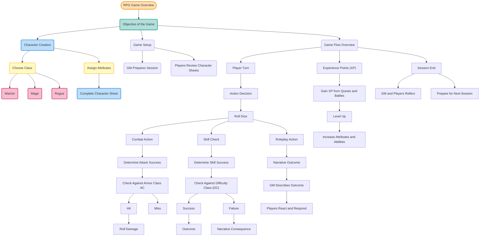

# RPG Game Overview Example

## Using `flowchart TD`

```mermaid
flowchart TD

%% Start and Overview 
A1(["RPG Game Overview"]):::orange
A2("Objective of the Game"):::green
A1 --> A2
A2 --> B1

%% Character Creation and Selection
B1("Character Creation"):::blue

B1 --> B2
B2("Choose Class"):::yellow

B2 --> B2a
B2a("Warrior"):::pink

B2 --> B2b
B2b("Mage"):::pink

B2 --> B2c
B2c("Rogue"):::pink

B3("Assign Attributes"):::yellow
B4("Complete Character Sheet"):::blue

%% Game Setup
C1(Game Setup)
C2(GM Prepares Session)

B1 --> B3
B3 --> B4
A2 --> C1
C1 --> C2
C1 --> C3
C3("Players Review Character Sheets")

A2 --> D1("Game Flow Overview")
D1 --> D2[Player Turn]
D2 --> D3[Action Decision]
D3 --> D4[Roll Dice]
D4 --> D5a[Combat Action] --> D6a[Determine Attack Success]
D4 --> D5b[Skill Check] --> D6b[Determine Skill Success]
D4 --> D5c[Roleplay Action] --> D6c[Narrative Outcome]

%% Combat Mechanics
D6a --> E1[Check Against Armor Class AC]
E1 --> E2[Hit] --> E3[Roll Damage]
E1 --> E4[Miss]

%% Skill Checks
D6b --> F1["Check Against Difficulty Class (DC)"]
F1 --> F2[Success] --> F3[Outcome]
    F1 --> F4[Failure] --> F5[Narrative Consequence]

    %% Roleplay and Storytelling
    D6c --> G1[GM Describes Outcome]
    G1 --> G2[Players React and Respond]

    %% Leveling Up and Progression
    D1 --> H1["Experience Points (XP)"]
    H1 --> H2["Gain XP from Quests and Battles"]
    H2 --> H3[Level Up]
    H3 --> H4[Increase Attributes and Abilities]

    %% Endgame and Session Wrap-up
    D1 --> I1[Session End]
    I1 --> I2[GM and Players Reflect]
    I1 --> I3[Prepare for Next Session]

%% Styling
classDef green fill:#B2DFDB,stroke:#00897B,stroke-width:2px;
classDef orange fill:#FFE0B2,stroke:#FB8C00,stroke-width:2px;
classDef blue fill:#BBDEFB,stroke:#1976D2,stroke-width:2px;
classDef yellow fill:#FFF9C4,stroke:#FBC02D,stroke-width:2px;
classDef pink fill:#F8BBD0,stroke:#C2185B,stroke-width:2px;
classDef purple fill:#E1BEE7,stroke:#8E24AA,stroke-width:2px;
```